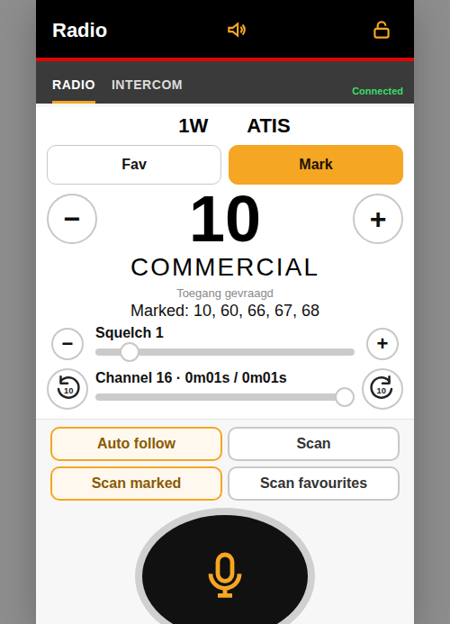
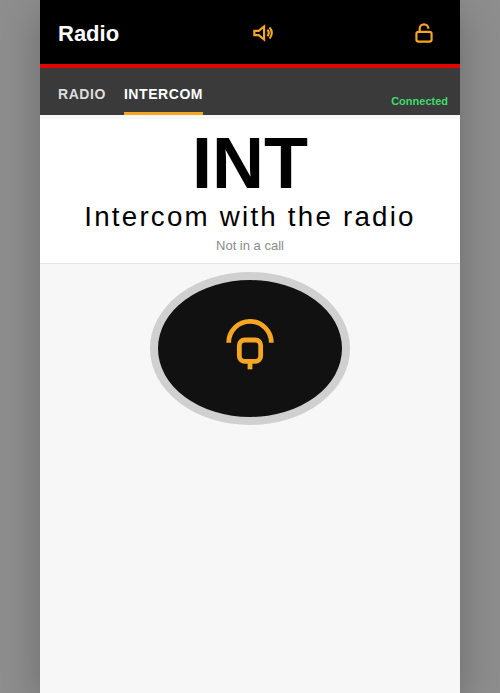

# signalk-icom-m510e-plugin

Signal K plugin for an Icom M510E over the radio's WLAN, using the same UDP session as the RS-M500 handset. It publishes the radio state, accepts channel and control commands, and serves a web remote.

NMEA 0183 from the radio is parsed into Signal K. Sentences on the `nmea0183out` event (for example from `@signalk/signalk-to-nmea0183` and `signalk-n2kais-to-nmea0183`) are forwarded to the radio so AIS targets can show on the M510 display. That replaces the old `signalk-ct-m500-plugin` for this boat; leaving CT-M500 enabled alongside this plugin blocks squelch changes.

| Radio | Intercom |
| --- | --- |
|  |  |

## Webapp

With the plugin installed, Signal K serves the remote at `/signalk-icom-m510e-plugin/`.

- Channel, name, 1W/25W, favourite, and the channel-group label (USA, INT, CAN, DSC, ATIS, or WX).
- Channel down and up. Both keep working while the channel is busy.
- Squelch from 0 to 10, with − and + beside the slider. The label and the value sit above the slider.
- Favourite and a marked-channel tick. Marked channels and favourite overrides are stored in the plugin data directory.
- Scan, Scan marked, and Scan favourites. A scan pauses on a busy channel and resumes after the configured silence time. The channel steps stay on the channel the radio reports, so a slow status does not skip ahead.
- Auto follow of the nearest VHF station.
- Push-to-talk on the Radio tab, and a separate Intercom tab for a call with the radio (see [Intercom](#intercom)).
- Received audio on every open webapp, each with its own cursor into a shared rewind buffer (see [Audio buffer](#audio-buffer)).

## Webapp states

- **Disconnected.** The radio is offline. The buttons do not drive it.
- If the radio stops answering for two minutes while Initializing or online, the plugin rediscovers and signs in again.
- **Connected.** This webapp has the buttons and push-to-talk / intercom, and it hears the audio.
- **Following.** Another webapp has the buttons and talk keys. This one still hears the audio and can rewind its own buffer. Take over moves the buttons and talk keys here and releases the other webapp's talk. Scan and auto follow keep running; they belong to the radio.
- **Locked.** This phone's buttons are blocked so they are not pressed by accident. The screen stays awake either way. Other webapps are unchanged.

Opening a second webapp does not take the buttons. Take over does.
- Lock blocks the buttons so they are not pressed by accident. The screen stays awake after the first touch. Mute silences playback.
- Saving the plugin config keeps the existing UDP session with the radio.

There is no DSC remote.

## Audio buffer

Received radio audio is kept in the plugin so every open webapp can listen live or rewind without holding its own full recording.

```
M510 RTP (μ-law, UDP 50001)
        │
        ▼
  plugin decode → PCM 8 kHz
        │
        ▼
  shared ring buffer  (length = config “Audio buffer length in minutes”, default 5)
        │  · stores PCM samples
        │  · marks the channel number whenever it changes
        │
        ├──► webapp A cursor (live or seeked)
        ├──► webapp B cursor
        └──► …
```

**What you see on the Radio tab**

- The scrubber label is `Channel N · XmYYs / XmYYs`: position in the buffer, total buffered length, and the channel that was active when that audio was recorded (so a rewind across a scan still shows which channel you are hearing).
- The −10 / +10 buttons jump ten seconds. Dragging the scrubber seeks; when you release near the end, playback catches up to live again.
- Mute only stops local playback. The buffer keeps filling.

**How it works**

1. The plugin receives RTP voice from the radio, converts μ-law to 16-bit PCM, and appends it to one ring buffer (`audio-buffer.js`). When the active channel changes, a mark is stored at that sample so the UI can label rewind by channel.
2. Each webapp opens a WebSocket at `/plugins/signalk-icom-m510e-plugin/audio`. It gets its own cursor into the same buffer. Live clients stay near the write head; a seek moves the cursor and plays from there until it catches up.
3. About five times a second the plugin sends a short status JSON (`duration`, `at`, `channel`, `marks`) so the scrubber and channel label stay in sync without shipping the whole buffer.
4. Only the **operator** webapp (Connected / Take over) may send microphone PCM upward for PTT or intercom. Followers still receive downlink audio and can rewind.

`communication.vhf.audio` is the IP of the operator webapp (or empty). It is not the buffer itself.

## Intercom

The Intercom tab is a private link between the phone and the radio’s built-in intercom — not a VHF transmission. It uses the same WebSocket and microphone path as PTT, but a different control command on the radio.

| | **Radio PTT** | **Intercom** |
| --- | --- | --- |
| Tab | RADIO | INTERCOM |
| Hold | Large mic button | Large headset button |
| Radio effect | Keys the transmitter (`OperationKey.PTT`) | Starts / ends an intercom call (`IntercomCommand.BEGIN_TALK` / `END`) |
| Air | On the current VHF channel | No RF — talk with someone at the radio |
| Side effects | Stops a running scan | Does not stop scan by itself |

**Operator only.** Like PTT, intercom only works while this webapp is Connected (or after Take over). A Following client can hear downlink audio but cannot open the call.

**Hold to talk**

1. Pointer down on the intercom button → webapp sends `{ op: "talk", mode: "intercom", down: true }` on the audio WebSocket and starts capturing the mic (8 kHz PCM chunks).
2. The plugin (operator socket only) calls `beginTalk('intercom')`, which sends the Icom intercom BEGIN_TALK frame on the control port.
3. Mic PCM is converted to μ-law RTP and sent to the radio on UDP 50001, same voice path as PTT.
4. Pointer up → `{ down: false }` → `endTalk()` → intercom END frame; mic capture stops.

The status line shows **Not in a call** or **In a call** from `communication.vhf.intercom` (the radio’s intercom flag in status frames). The button lights while held.

## Channel list, marked, and favourites

The plugin keeps one in-memory channel book per session. It is filled from the radio after sign-in, then layered with plugin-local lists.

```
Radio (names + properties)     Plugin data directory
┌────────────────────────┐     ┌─────────────────────────┐
│ nr + mode (00/10/20)   │     │ marked.json             │
│ name                   │     │   → communication.vhf   │
│ enabled / inhibited    │     │     .marked             │
│ duplex, watt           │     │ favourites.json         │
│ fav bit from radio     │──┐  │   → favOverride map     │
└────────────────────────┘  │  └─────────────────────────┘
                            ▼
                   entry.fav = override if set,
                               else radio fav bit
```

| Source | What it is | Leading for |
| --- | --- | --- |
| Radio names + properties | Full book for the current channel group (USA / INT / CAN / ATIS / …): number, name, enabled, duplex, power, and the radio's own favourite flag | Channel up/down and **Scan** (all enabled channels in the current mode) |
| `marked.json` → `communication.vhf.marked` | Ordered list of channel **numbers** ticked in the webapp. Plugin-only; the radio does not store it | **Scan marked** and the Mark tick. Not the same as favourites |
| `favourites.json` → `favOverride` | Per-channel-index overrides of the radio favourite flag. Empty means “trust the radio” | **Scan favourites** and the Favourite button. An override wins over the radio bit until cleared |
| VHFinfo path (default `resources.vhfdata.nearest.0`) | Station JSON / channel string from the [VHFinfo plugin](https://github.com/htool/vhfinfo). Parsed to one or more channel numbers | **Auto follow** only |

Rules of thumb:

- **Marked** is always the plugin list. Marking 16 does not make it a radio favourite.
- **Favourites** start as the radio's fav bits. The webapp Favourite toggle writes an override; that override is what Scan favourites and the UI star use.
- Channel up/down stay in the current `mode` bank and skip `enabled: false` entries (except when stepping a marked or follow list).
- Auto follow never writes marked or favourites; it only tunes (or scans) the channel numbers from the nearest-station path.

## Scan and auto-follow

`communication.vhf.scanMode` is the scan state: empty (idle), `all`, `marked`, `favourites`, or `follow` (internal multi-channel auto follow). Auto follow itself is the separate boolean `communication.vhf.autofollow`.

A user scan (**Scan** / **Scan marked** / **Scan favourites**) always wins over auto follow's own `follow` scan. While a user scan runs with auto follow on, channels from the nearest path are **merged into** that scan (so a marked scan can also stop on the marina channel).

```
                         ┌──────────────────────────────────────┐
                         │              IDLE                    │
                         │  scanMode = ""                       │
                         │  +/− / keypad set the channel        │
                         └───────┬───────────────┬──────────────┘
                    Auto follow  │               │  Scan /
                    ON           │               │  Scan marked /
                                 │               │  Scan favourites
                                 ▼               ▼
              ┌─────────────────────────┐   ┌─────────────────────────┐
              │   AUTO FOLLOW           │   │   USER SCAN             │
              │   autofollow = true     │   │   scanMode =            │
              │                         │   │     all | marked |      │
              │  nearest has 1 channel  │   │     favourites          │
              │    → after silence*,    │   │                         │
              │      set that channel  │   │  step +1 on that list   │
              │                         │   │  pause while busy;      │
              │  nearest has 2+         │   │  resume after           │
              │    → scanMode=follow    │   │  scanResume silence     │
              │      (scan that list)   │   │                         │
              └───────────┬─────────────┘   │  if autofollow ON:      │
                          │                 │    also visit nearest   │
           user starts a  │                 │    channels in the step │
           Scan* button   │                 └───────────┬─────────────┘
                          ▼                             │
              ┌─────────────────────────┐               │
              │   USER SCAN (same as    │◄──────────────┘
              │   right) — follow scan  │   same mode again: no-op
              │   is stopped            │   Scan* off / scanStop:
              └─────────────────────────┘     → IDLE (autofollow
                                              may retake follow)

  * silence = plugin config “Auto follow: seconds of silence…”
    Immediate when autofollow is toggled on.
  * Pressing the active Scan* button does not toggle off;
    send scanMode "off" (or scanStop) to stop.
  * PTT stops any scan and returns to IDLE (autofollow may retake).
```

Button summary:

| Action | Effect |
| --- | --- |
| **Auto follow** on | Read nearest now. One channel → tune (immediate on toggle, else after silence). Several → start `follow` scan. |
| **Auto follow** off | Stop `follow` scan if it was running. Leave the current channel. |
| **Scan** / **Scan marked** / **Scan favourites** | Start that user scan. Stops a `follow` scan. Marked needs a non-empty marked list. |
| Scan mode **off** | Idle. Auto follow may start `follow` again if it is still on and nearest has 2+ channels. |
| **+1** during a scan | Jump to the next channel of that scan and continue from there. |

## Signal K

Values are published under `communication.vhf`:

```
communication.vhf.ip            string    Radio IP, while a session exists
                 .port          number    Radio UDP port
                 .status        string    offline, Initializing RS-M500, or online
                 .squelch       number    0–10
                 .horn          boolean   Fog horn sounding
                 .scanning      boolean   Radio scan flag
                 .dualwatch     boolean   Dual watch
                 .intercom      boolean   Intercom call
                 .channelGroup  string    USA, INT, CAN, DSC, ATIS, WX, or empty
                 .silence       number    Seconds since the channel went quiet
                 .channel       object    Active channel, see below
                 .audio         string    IP of the operator webapp (Connected / Take over), or empty
                 .marked        number[]  Channel numbers ticked in the webapp
                 .scanMode      string    all, marked, favourites, follow, or empty
                 .autofollow    boolean   Auto follow is on
```

`communication.vhf.bank` is written as an empty string so an older value does not linger. Channel group lives on `channelGroup`. Marked and favourites are described under [Channel list, marked, and favourites](#channel-list-marked-and-favourites); scan and auto-follow under [Scan and auto-follow](#scan-and-auto-follow); rewind audio under [Audio buffer](#audio-buffer); talk keys under [Intercom](#intercom).

`communication.vhf.channel` is one object:

```
{
  "nr": 16,
  "duplex": false,
  "hilo": true,
  "fav": true,
  "name": "CALLING",
  "watt": 25,
  "mode": "00",
  "enabled": true,
  "busy": false
}
```

`mode` is `00`, `10`, or `20` (the USA, INT, and CAN lists). `watt` is 1 or 25. `busy` is receiving on that channel.

## API

PUT `vessels.self` paths. Each call returns `{ "state": "COMPLETED", "statusCode": 200 }` or `400`.

Channel (`communication.vhf.channel`):

```
curl -H "Content-Type: application/json" -X PUT \
  http://localhost:3000/signalk/v1/api/vessels/self/communication/vhf/channel \
  -d '{"value": "+1"}'
```

`value` is `+1`, `-1`, `scanAll`, `scanFav`, `scanStop`, a channel number (list `00`), or four characters of list plus number, for example `0016`, `1016`, or `2016`.

| Path | Value |
| --- | --- |
| `communication.vhf.squelch` | 0–10 |
| `communication.vhf.watt` | any value toggles 1W / 25W |
| `communication.vhf.scanning` | any value toggles the radio scan |
| `communication.vhf.dualwatch` | any value toggles dual watch |
| `communication.vhf.ptt` | `true`, `1`, or `down` presses; anything else releases |
| `communication.vhf.intercom` | `true`, `talk`, or `begin` starts; anything else ends |
| `communication.vhf.autofollow` | `toggle`, or `1` / `true` / `on` |
| `communication.vhf.marked` | `toggle` for the active channel number |
| `communication.vhf.scanMode` | `all`, `marked`, `favourites`, or `off` (same mode again is a no-op; only `off` stops). `follow` is set by auto follow when nearest has several channels |
| `communication.vhf.fav` | `toggle` |

Auto follow reads the nearest station from the path set in the plugin config (`resources.vhfdata.nearest.0` by default). That value is the JSON object published by the [VHFinfo plugin](https://github.com/htool/vhfinfo). Its `channel` field is used; a list such as `12/16` becomes a multi-channel follow scan. See [Scan and auto-follow](#scan-and-auto-follow).

With a **single** nearest channel, `scanMode` stays empty (`""`): auto follow only tunes that channel. Empty `scanMode` does not turn auto follow off — `follow` is only used when nearest lists several channels.

## Plugin config

| Setting | Default |
| --- | --- |
| Path to check for auto-follow mode | `communication.vhf.autofollow` |
| Signal K path of the nearest VHF station | `resources.vhfdata.nearest.0` |
| Auto follow: seconds of silence before changing channel | 30 |
| Scan: seconds of silence before resuming | 30 |
| Audio buffer length in minutes | 5 (shared ring buffer for live listen + rewind; see [Audio buffer](#audio-buffer)) |
| Icom M510E IP | empty; discovery is broadcast |

The nearest-station path is a JSON object from the [VHFinfo plugin](https://github.com/htool/vhfinfo). When the IP is set, discovery is sent to that address instead of the broadcast.
